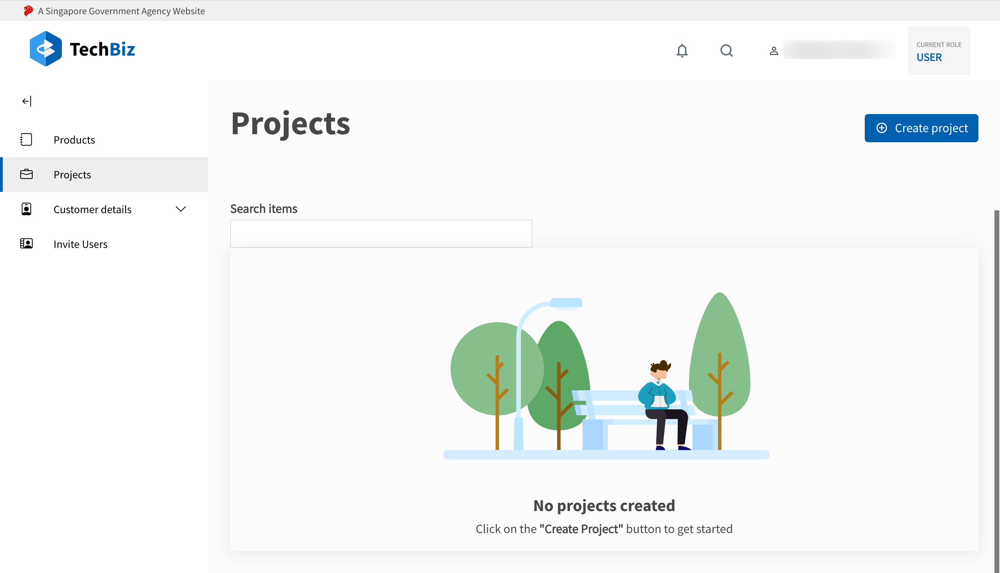
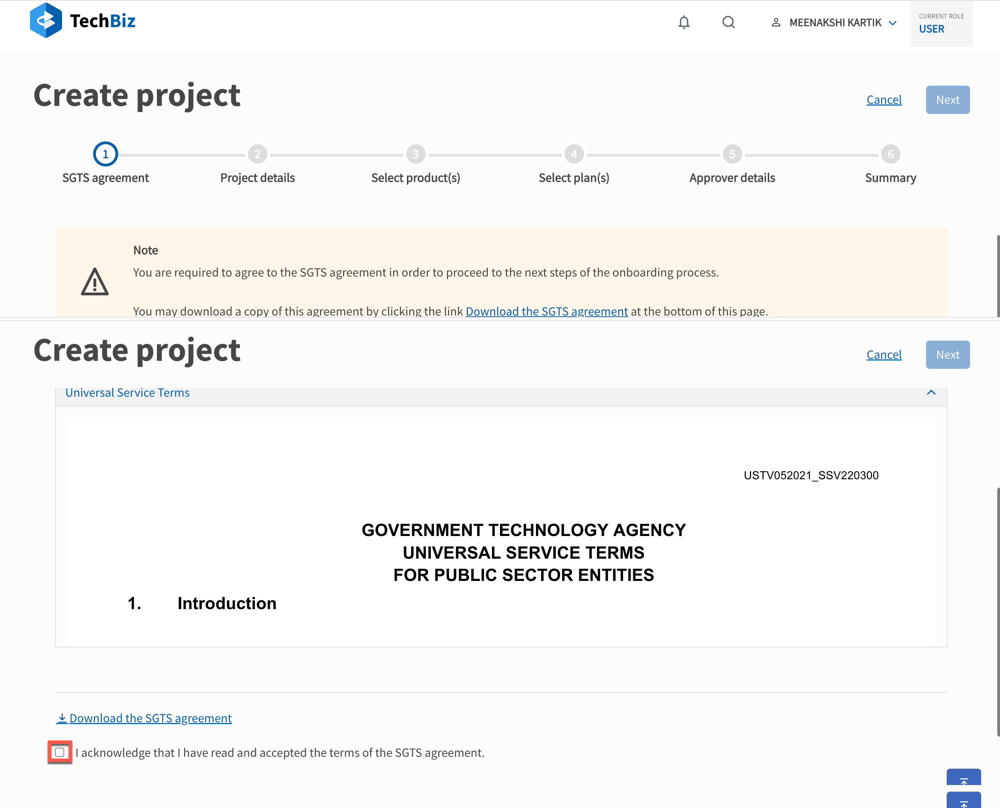

# Onboard TechBiz

If you are interested in subscribing to SGTS product(s), you will need to onboard your agency onto TechBiz via the [TechBiz Portal.](https://portal.dev.techbiz.suite.gov.sg/)

## Getting Started

The high-level steps to onboard your agency are:

1. [**Create your agency namespace in TechBiz**](#create-system)
2. [**Obtain approval**](#obtain-approval)
3. [**Configure Products**](#configure-products)

Let us look at each step in detail.

### Create Agency Namespace

1. Goto the [**TechBiz Portal.**](https://portal.dev.techbiz.suite.gov.sg/)
2. Click **Login with TechPass.**

The Overview page is displayed.

3. In the Overview page, click **View systems** or in the sidebar, click **Systems**

The Systems page is displayed.

4. In the Systems page, click **Create System.**

The Create system workflow is displayed.

screenshot of create system workflow

Ensure that you have the required information ready, and click **Next.**

a. **SGTS agreement:** Select “I acknowledge that I have read and accepted the terms of the SGTS agreement” to agree to the SGTS Universal Service Terms. Click **Next.**

b. **System details:** 

### Obtain Approval

### Configure Products

