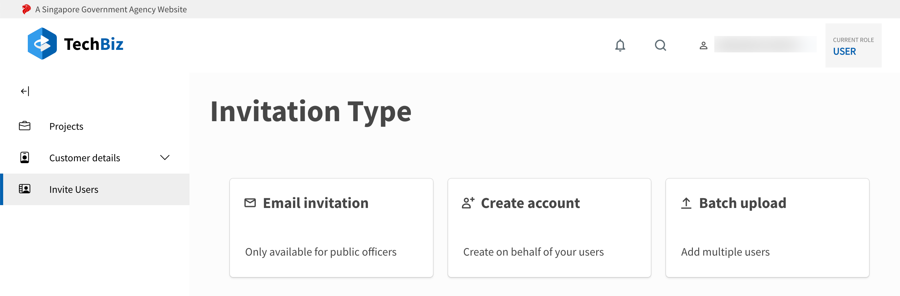

# Invite Users

The **Invite Users** module allows Public Officers to conveniently manage user access to SGTS products via the TechBiz Portal.

## Getting Started

To access SGTS products, Users require a TechPass account. The TechPass account creation process is triggered, when a User receives an invitation email.

This guide shows you how to send TechPass invitation emails to Users from the **Invite Users** module in the TechBiz Portal.

### Prerequisites

- Public Officers need to access the TechBiz Portal using their organisation email (gov.sg) from a GSIB device.

### Send TechPass invitation email

1. Goto the [**TechBiz Portal.**](https://portal.dev.techbiz.suite.gov.sg/)
2. Click **Login with TechPass.**

3. From the Overview page **or** the left sidebar, click **Invite Users.**

The three options to send TechPass invitations are displayed.

A. Email Invitation - Create TechPass accounts for Public Officers. 

  - Enter the following details, and then click **Submit.**

  |Field Name| Description | Behaviour and Usage |
  |---- |---- |---- |
  | Email address| Email of User who requires a TechPass account| Should be a gov.sg email
  | Is onboarding to [SEED](https://docs.developer.tech.gov.sg/docs/security-suite-for-engineering-endpoint-devices/#/) required | Does User need a SEED account? | Indicate **Yes** or **No**|
  |Reason | Reason for requirement of a TechPass account|

 &nbsp

B. Create Account - To create TechPass accounts on behalf of Vendors as well as Public Officers.

  - Enter the following account details, and then click **Submit.**

   |Field Name| Description | Behaviour and Usage|
  |---- |---- |---- |
  | Email address| Email of User who requires a TechPass account| Gov.sg or vendor email
  | TechPass username| Should start and end with alphanumeric characters, contains only alphanumeric characters, dash (-), underscore (_) and period (.) [no two consecutive periods] | This field is required if User is a Vendor. If User is a Public Officer, this field will be greyed out.
  |First Name | First Name of User|
  |Last Name | Last Name of User |
  |Contact Number| Mobile Number of User|
  |Organisation |Organisation Name |
  |Department| Department Name| This is an optional field
| Is onboarding to SEED required | Does User need a SEED account?| Indicate **Yes** or **No**|
  |Reason | Reason for requirement of a TechPass account|

 &nbsp

C. Batch Upload - To create TechPass accounts for multiple users. 

   - Click **Download excel template.**

  > **Note:** The template is a csv file with input fields.

   - Fill in the following user details in the template.

   |Field Name| Description | Behaviour and Usage|
  |---- |---- |---- |
  | Email| Email of User who requires a TechPass account| Gov.sg or vendor email
  | Username| Should start and end with alphanumeric characters, contains only alphanumeric characters, dash (-), underscore (_) and period (.) [no two consecutive periods] | This field is required if User is a Vendor. If User is a Public Officer, this field will be greyed out.
  |First Name | First Name of User|
  |Last Name | Last Name of User |
  |Contact Number| Mobile Number of User|
  |Organisation |Organisation Name |
  |Department| Department Name| This is an optional field
| Is onboarding to SEED required | Does User need a SEED account?| Indicate **Yes** or **No**|
  |Reason | Reason for requirement of a TechPass account|

   - To select and upload the template, click **Choose a file.** 
   
   Once the file has been uploaded, the users details list will be displayed.

   - Review the user details.

  > **Tip:** You can edit user details or even remove users from the displayed list.

    - Click **Submit.**

    

