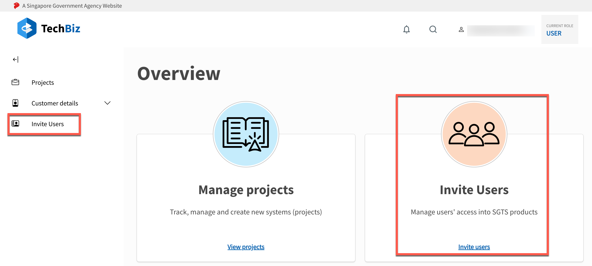

# Invite Users

The **Invite Users** module allows Public Officers to conveniently manage user access to SGTS products via the TechBiz Portal.

## Getting Started

To access SGTS products, Users require a TechPass account. The TechPass account creation process is triggered, when a User receives an invitation email.

This guide shows you how to send TechPass invitation emails to Users from the **Invite Users** module in the TechBiz Portal.

### Prerequisites

- Public Officers need to access the TechBiz Portal using their organisation email (gov.sg) from a GSIB device.

### Send TechPass invitation email

1. Goto the [**TechBiz Portal.**](https://portal.dev.techbiz.suite.gov.sg/)
2. Click **Login with TechPass.**

3. From the Overview page **or** the left sidebar, click **Invite Users.**

The three options to send TechPass invitations are displayed.

4. Select an option depending on your use case.

 A. Email Invitation - To create TechPass accounts for Public Officers. 

  - Enter the email address of the User who requires a TechPass account. (Only public officer organisation emails).

  - Indicate whether the device needs to be onboarded to [**SEED.**](https://docs.developer.tech.gov.sg/docs/security-suite-for-engineering-endpoint-devices/#/)

  - Provide a reason for requiring a TechPass account.

  - Click **Submit.** 

  

  

 B. Create Account - To create TechPass accounts on behalf of Vendors as well as Public Officers. 

  
   - Enter the email address of the User who requires a TechPass account.

   - Indicate the TechPass username (only if user is a Vendor).

    > **Note:** If User is a Public Officer, the TechPass username field will be greyed out.

   - Enter the User details.

   - Indicate whether the device needs to be onboarded to [**SEED.**](https://docs.developer.tech.gov.sg/docs/security-suite-for-engineering-endpoint-devices/#/)

   - Provide a reason for requiring a TechPass account.

   - Click **Submit.**

C. Batch Upload - To create TechPass accounts for multiple users. 

   - Click **Download excel template.**

  > **Note:** The template is a csv file with input fields.

   - Fill in the user details in the template.

   - To select and upload the template, click **Choose a file.** 
   
   Once the file has been uploaded, the users details list will be displayed.

   - Review the user details.

  > **Tip:** You can edit user details or even remove users from the displayed list.

    - Click **Submit.**

    

