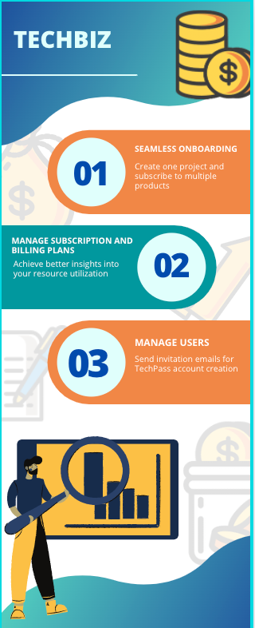
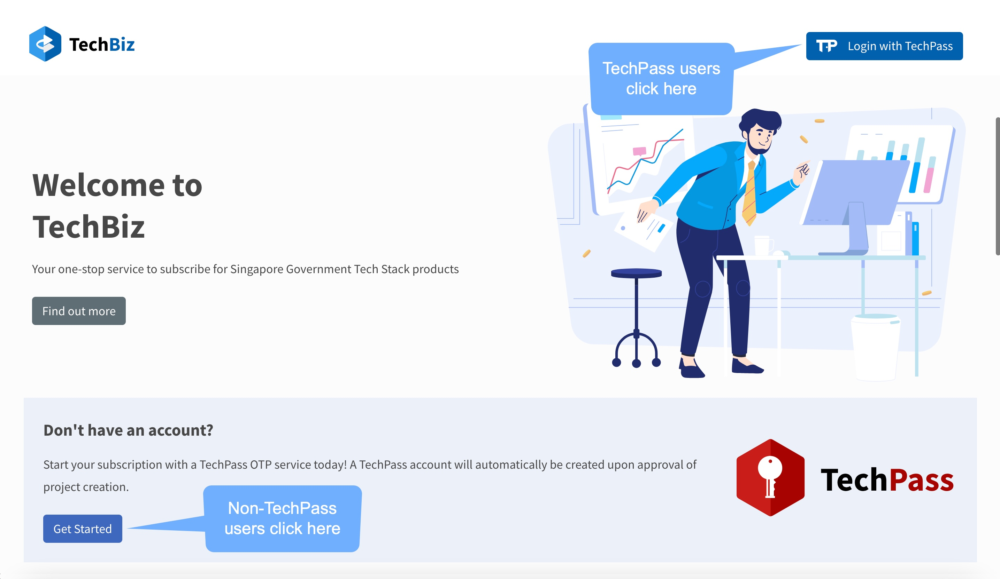

# TechBiz Overview

TechBiz is a one-stop shop for government agencies to subscribe to Singapore
Government Tech Stack (SGTS) products.

It offers seamless contract management. For example, agencies can create a single system in TechBiz and onboard to multiple SGTS products. 

TechBiz aims to oversee agency subscription from the point of engagement to operations to termination.

TechBiz belongs to the Service Management category in the base layer of
[Singapore Government Tech Stack
(SGTS).](https://www.developer.tech.gov.sg/singapore-government-tech-stack/overview/index.html)

## Features

## Commonly-used Terms

| Term    | Definition     | Example
|-----    | ------     | ------|
| Product | An application in Singapore Government Tech Stack (SGTS). | SHIP|
| Item    | An entity belonging to a single product. | JIRA User (SHIP)|
| Project | A system created by an Agency that wants to subscribe to SGTS Products. | Ministry of Manpower (MOM) wants to use SHIP |
| Subscription | An arrangement between an agency and a product based on the plan the agency has subscribed to. | MOM subscribed to basic JIRA Plan in SHIP starting from 1 March 2022.|
| Billing | The amount chargeable to an agency based on their subscription. | MOM is charged 10 dollars per month for usage of SHIP products.|
| Billing Rules | The different types of pricing models. | Fixed One Time|
| Plan | A breakdown of the chargeable components with the specified charges. Plans can be: <ul> <li>Individual (single item)</li> <li>Bundle (multiple items)</li><li>Add On (Single item but must be subscribed with an Individual or Bundle Plan)</li></ul> | Plan Name: Basic JIRA Plan Definition: 5 JIRA users at a fixed price of 10 dollars per month|
| DGP | A **Digital Governance Platform** that tracks all live systems across the Whole-of-Government.|

## Getting Started

**Topics**
  - [TechBiz Portal](#techbiz-portal)
  - [Roles and Permissions](#roles-and-permissions)
  - [Prerequisites](#pre-requisites)
  - [Access TechBiz Portal](#access-techbiz-portal)

### TechBiz Portal

Techbiz offers an interactive portal for agencies to subscribe to SGTS products.
Agencies will need a TechPass account login to the [TechBiz portal](https://portal.dev.techbiz.suite.gov.sg/) to create projects, manage users, manage subscriptions, and billing plans.

### Roles and Permissions

| TechBiz Portal Role | Agency Role
| ---- | ----- |
|Subscription Admin (Primary/Secondary)| Project Incharge, Agency Project Managers|
| Requestor|Public Officer, Agency Project Manager, Project Team Member   |
| Approver |Project Incharge|
| Technical Contact | Public Officer or Vendor |
| Billing Contact | Public Officer |

### Pre-requisites

- Make sure that access to the TechBiz Portal is available:

  - To Public Officers (PO) with a public service official email.

  - From a GSIB device.

- A TechPass account is required to access SGTS products! Non-TechPass users can initiate the subscription process using the TechBiz portal. However, only after the subscription is approved will a TechPass account be created for the user.

### To access the TechBiz Portal

1.  Click [**here.**](https://portal.dev.techbiz.suite.gov.sg/)

    The TechBiz Portal landing page is displayed.

    
    
2. Navigate to the [Portal](https://portal.dev.techbiz.suite.gov.sg/)

   - TechPass users:

     - Click **Login with TechPass.**

     - Follow the on-screen instructions and approve sign-in request.

   - Non-TechPass users:

     - To register for the TechPass OTP service, click **Get Started.**

     - Enter your public service official email address (only gov.sg
    emails) and click **Next.**

     - Enter the OTP received in your email and click **Submit.**

The self-service TechBiz admin portal overview page with **Manage Projects** and **Invite Users** module is displayed.

