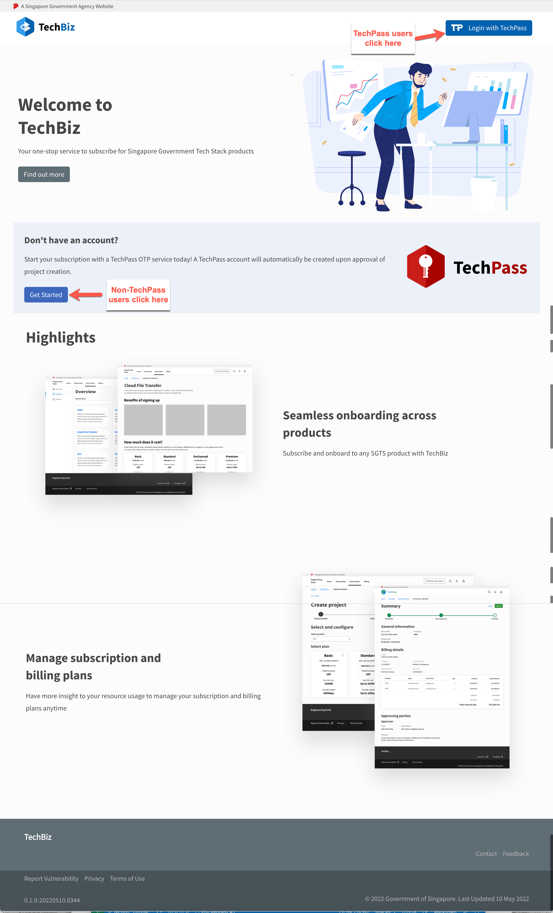
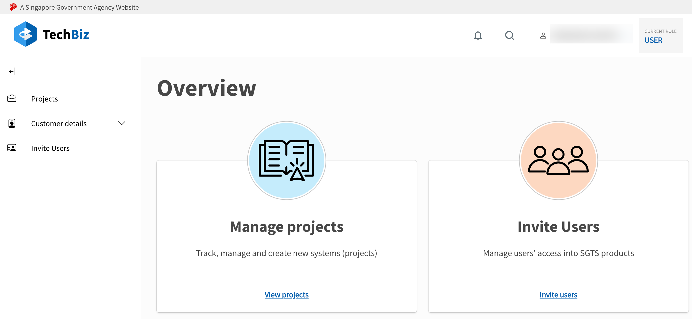

<!-- # TechBiz Overview

TechBiz is a one stop shop for government agencies to subscribe to Singapore
Government Tech Stack (SGTS) products.
It offers seamless contract management by streamlining onboarding for all SGTS products within the TechBiz Portal. As an Agency Subscription Admin, you will be required to sign a single MOU for subscribing to multiple SGTS products.

TechBiz aims to oversee agency subscription from the point of engagement to operations to termination.

TechBiz belongs to the Service Management category in the base layer of
[Singapore Government Tech Stack
(SGTS).](https://www.developer.tech.gov.sg/singapore-government-tech-stack/overview/index.html)

## Features

## Commonly Used Terms

| Term    | Definition     | Example
|-----    | ------     | ------|
| Product | An application in Singapore Government Tech Stack (SGTS). | SHIP|
| Item    | An entity belonging to a single product. | JIRA User (SHIP)|
| System | A namespace created by an Agency that wants to subscribe or onboard to SGTS Products. | Ministry of Manpower (MOM) wants to use SHIP. |
| Subscription | An arrangement between an agency and a product based on the plan the agency has subscribed to. | MOM subscribed to basic JIRA Plan in SHIP starting from 1 March 2022.|
| Billing | The amount chargeable to an agency based on their subscription. | MOM is charged 10 dollars per month for usage of SHIP products.|
| Billing Rules | The different types of pricing models. | Fixed One Time.|
| DGP | A **Digital Governance Platform** that tracks all live systems across the Whole-of-Government.|
| Plan | A breakdown of the chargeable components with the specified charges. Plans can be: <ul> <li>Individual (single item)</li> <li>Bundle (multiple items)</li><li>Add On (Single item but must be subscribed with an Individual or Bundle Plan)</li></ul> | **Plan Name:** Basic JIRA Plan **Definition:** 5 JIRA users at a fixed price of 10 dollars per month|

## TechBiz Portal

Techbiz offers an interactive [Portal](https://portal.dev.techbiz.suite.gov.sg/) for agencies to onboard to SGTS products.
Agencies will need a TechPass account to manage projects, users, subscriptions, and configure products within the Portal.

**Topics**
  - [Roles and Permissions](#roles-and-permissions)
  - [Prerequisites](#pre-requisites)
  - [Login to the TechBiz Portal](#login-to-the-techbiz-portal)

### Roles and Permissions
The table below maps roles within the Portal to agency roles.

| TechBiz Portal Role | Agency Role | Permissions
| ---- | ----- |----|
|<ul><li>Subscription Admin (Primary/Secondary)</li><li>Requestor</li><li>Approver</li><li>Billing Contact</li></ul> | Public Officer |
| Technical Contact | Public Officer or Vendor

### Prerequisites
Public Officers can access the TechBiz Portal using their organisation email (gov.sg) from a GSIB device.

### Login to the TechBiz Portal

1. Goto the [TechBiz Portal.](https://portal.dev.techbiz.suite.gov.sg/)

    The landing page is displayed.

    

2. Login to the Portal as follows:

   A. TechPass users:

     1. Click **Login with TechPass.**

     2. Follow the on-screen instructions and approve sign-in request.

   B. Non-TechPass users:

     1. To register for the TechPass OTP service, click **Get Started.**

     2. Enter your public service organisation email and click **Next.**

     3. Enter the OTP received in your email and click **Submit.**

The TechBiz Portal overview page is displayed.

 -->