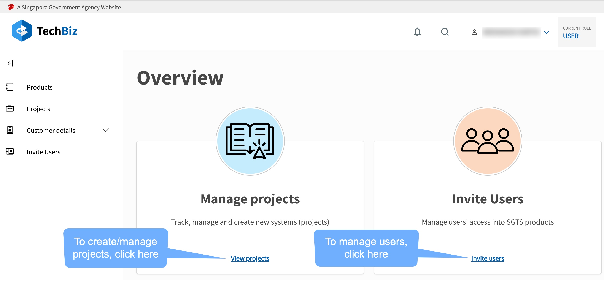

TechBiz Tutorial

# What is TechBiz?

A one-stop shop for government agencies to subscribe to Singapore
Government Tech Stack (SGTS) products.

TechBiz has been designed to achieve a commonality among SGTS products
by offering seamless contractual management. It aims to oversee
agencies\' subscription from the point of engagement to operations /
termination.

TechBiz belongs to the Service Management category in the base layer of
[Singapore Government Tech Stack
(SGTS).](https://www.developer.tech.gov.sg/singapore-government-tech-stack/overview/index.html)

# Features

# Commonly-used Terms

| Term    | Definition     | Example
|-----    | ------     | ------|
| Product | Products that are in Singapore Government Tech Stack (SGTS) | SHIP|
| Item    | An item belongs to a single product | JIRA User (SHIP)|
| Project | Created by an Agency that wants to subscribe/onboard to SGTS Products | Ministry of Manpower (MOM) wants to use SHIP |
| Subscription | Define the arrangement between agency and product based on the plans they subscribed to | MOM subscribed to SHIP's basic JIRA Plan starting from 1 March 2022|
| Billing | Determine the amount to charge to agency based on their subscription | MOM pay 10 dollars per month to SHIP |
| Billing Rules | Different types of pricing models | Fixed One Time|
| Plan | Define how agency will be charged when using the product. Plan can be Individual (single item) or Bundle (multiple items) or Add On (Single item but must be subscribed with an Individual or Bundle Plan) | Plan Name: Basic JIRA Plan Definition: 5 JIRA users at a fixed price of 10 dollars per month|
| DGP | Digital Governance Platform - Tracks all systems across the Whole-of-Government|

# Getting Started

# TechBiz Portal

Techbiz offers an interactive portal for agencies to subscribe to SGTS products.
Agencies will need a TechPass account login to the self-service portal
to create projects, manage users, manage subscriptions and billing
plans.

> - TechBiz portal is accessible from GSIB laptop!

# Roles and Permissions

| TechBiz Portal Role | Agency Role
| ---- | ----- |
|Subscription Admin (Primary/Secondary)| Project Incharge, Agency Project Managers|
| Requestor|Public Officer, Agency Project Manager, Project Team Member   |
| Approver |Project Incharge|
| Technical Contact | Public Officer or Vendor |
| Billing Contact | Public Officer |

## Requirements to access TechBiz portal

-   Public Officers (PO) with a public service official email

-   GSIB device

# Onboarding to TechBiz

1.  To create your agency's namespace within TechBiz and subscribe to SGTS
    products, click [here](https://portal.dev.techbiz.suite.gov.sg/)

2.  The TechBiz self-service admin portal landing page will be
    displayed.

    

!>Important:Non-TechPass users can initiate the subscription process using the
    TechBiz portal. However, only after the subscription is approved
    will a TechPass account be created for the user.
    A TechPass account is required to access SGTS products!

3.  If you are an existing TechPass user:

-   Click "Login with TechPass".

-   Follow the on-screen instructions and approve sign-in request. Goto
    Step 4.

4.  If you are not a TechPass user:

-   Click "Get Started" to register for the TechPass OTP service.

-   Enter your public service official email address (only gov.sg
    emails) and click "Next".

-   Enter the OTP received in your email and click "Submit".

5.  The self-service TechBiz admin portal overview page with "Manage
    Projects" and "Invite Users" module is displayed.

    

# Invite Users

Subscription admin or any public officer (.gov.sg emails) can trigger TechPass account creation for users from the portal itself. This eliminates the need for public officers to goto the TechPass portal and self-sign up; or for SGTS product teams to create TechPass accounts for vendors.

To view the available invitation types, click **"Invite Users"** from the Overview page or the left sidebar.

1. Email invitation

> This method is for TechPass account creation for public officers only. It is similar to the self-sign up process in TechPass portal. 

The public officer needs to:

- Enter the email address of the user who requires a TechPass account. (Only valid gov.sg email)

- Indicate whether the device needs to be onboarded to SEED.

- Provide a reason for the requirement of a TechPass account.

2. Create Account

> This method can be used to create TechPass account on behalf of vendors as well as public officers.

The Public Officer needs to:

- Enter the email address of the user who requires a TechPass account.

- Indicate the TechPass username (only if user is a vendor).

> If user is a public officer, the TechPass username field will be greyed out.

- Enter the user's name, contact number, organization and department details.

- Indicate whether the device needs to be onboarded to SEED.

- Provide a reason for the requirement of a TechPass account.

- To trigger TechPass account creation click "Submit".

3. Batch Upload

Conveniently create TechPass accounts for multiple users at one shot.

- Download the excel template provided.

- Fill in the users' information.

- To upload the file click "Choose a file".

- Once the file has been uploaded, the users' details will be displayed.

> It is possible to edit user details or even remove users from the displayed list.

- Once the list is final, click "Submit" to trigger TechPass account creation.

