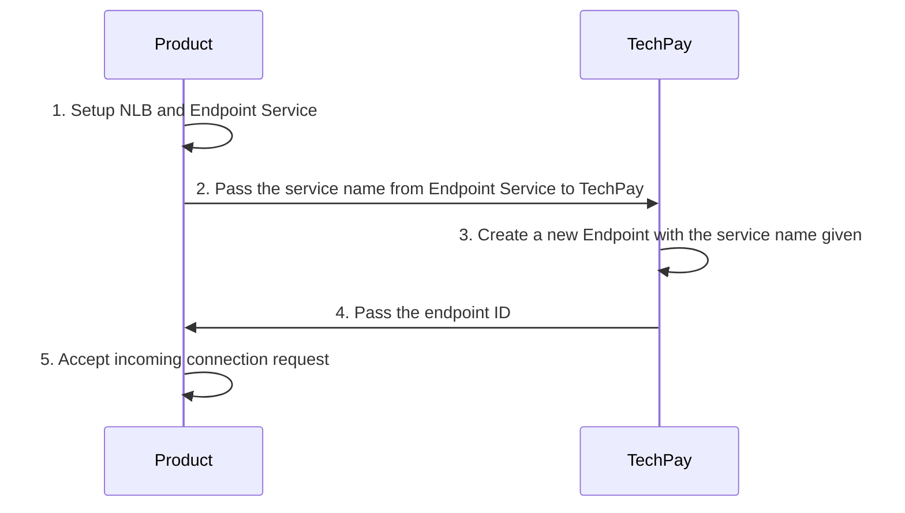

# Overview
TechPay needs to get the actual Usage value in order to generate invoice for billing purposes. Hence, TechPay needs to call each indivual `Products`' usage API endpoints to get the daily/monthly usage for a particular `Project` and a particular `Item`. 
P.S. Check out [Domain Terms](domain_terms.md) for more information about domain information.
## Requirements
### Functional Requirements
* Accepts a valid `Item` identifier.
* Accepts a valid `Project` identifier.
* Accepts a date range.
* Returns usage data based on the above parameters.
Link to [TechPay Usage Demo API OpenAPI Documentation](https://stg.docs.developer.gov.sg/docs/private/341123320/techpay-usage-demp-api/)

### Security Requirements
* Usage API endpoint exposes only to TechPay.
* Usage API endpoint has to be authenticated.
* Usage API endpoint exposes to TechPay IP/network.

## Key Concepts
The key concept would be the authentication flow. We are using Azure Active Directory (AAD) for authentication. We are following Access Token way of authentication where TechPay calls AAD and get access token before calling Usage API. The Usage API will then validate if the request is valid.

## Workflow

### *: Validate all neccessary data:
1. Audience (App Id URI) matches
2. App ID matches
3. Issuer matches
4. Tenant matches
5. x5t & kid matches JWKS keys
6. Not expired and within valid time window (exp, nbf)

### Networking with AWS VPC


# Getting Started
There's a demo [repository](https://bitbucket.ship.gov.sg/projects/TECHSBUSIN/repos/techpay-demo-usage-api) that you can check. It includes the workflow from step 2 to 8. There's a sample app registered as well (Step 1). It can be used as a reference for both the API contract and the workflow implementations.

## App Registration
TechPay will perform Step 1, to register, upload public certificate and setup the App, keep the private key in AWS secret manager (The Certification and Private key will be having a rotatation maximumly 13 months). Then TechPay will pass these information to relavent `Product` for validations later:
1. Tenant ID
2. Audience
3. App ID
4. Issuer
5. JWKS url

## Networking whitelisting
TechPay will be calling each `Product`'s Usage API from AWS Lambda. This requires Lambda to configure access to the private VPC

## Expose Usage API
Visit [HERE](https://stg.docs.developer.gov.sg/docs/private/341123320/techpay-usage-demp-api/) for Swagger API.
The usage data response will be in days even if the request is for a month. For example, requesting `from: 01-12-2020`, `to: 31-12-2020`, the response will be: 
```js
{
    "data": [
        {
            "start": "01-12-2020",
            "end": "01-12-2020",
            "usage": 1,
        },
        {
            "start": "02-12-2020",
            "end": "02-12-2020",
            "usage": 1,
        },
        {
            "start": "03-12-2020",
            "end": "03-12-2020",
            "usage": 2,
        },
        // .... usage here is the NET usage on that day
        {
            "start": "31-12-2020",
            "end": "31-12-2020",
            "usage": 8,
        }
        // On the last day, the usage is 8, means the whole month usaged 1 + 1 + 2 + ... + 8 units
    ]
}
```
## How to validate Access Token
Access Token will be passed in the request header
`-H  "Authorization: Bearer SLDKFJSDFI"...`
It is recommended to use a library to do the validation. For example Node.js project from the demo app, uses `jsonwebtoken` library to do the validation and `jwks-rsa` library to retrieve keys from AAD and validate if the token was signed with the rotated public keys from AAD JWKS.