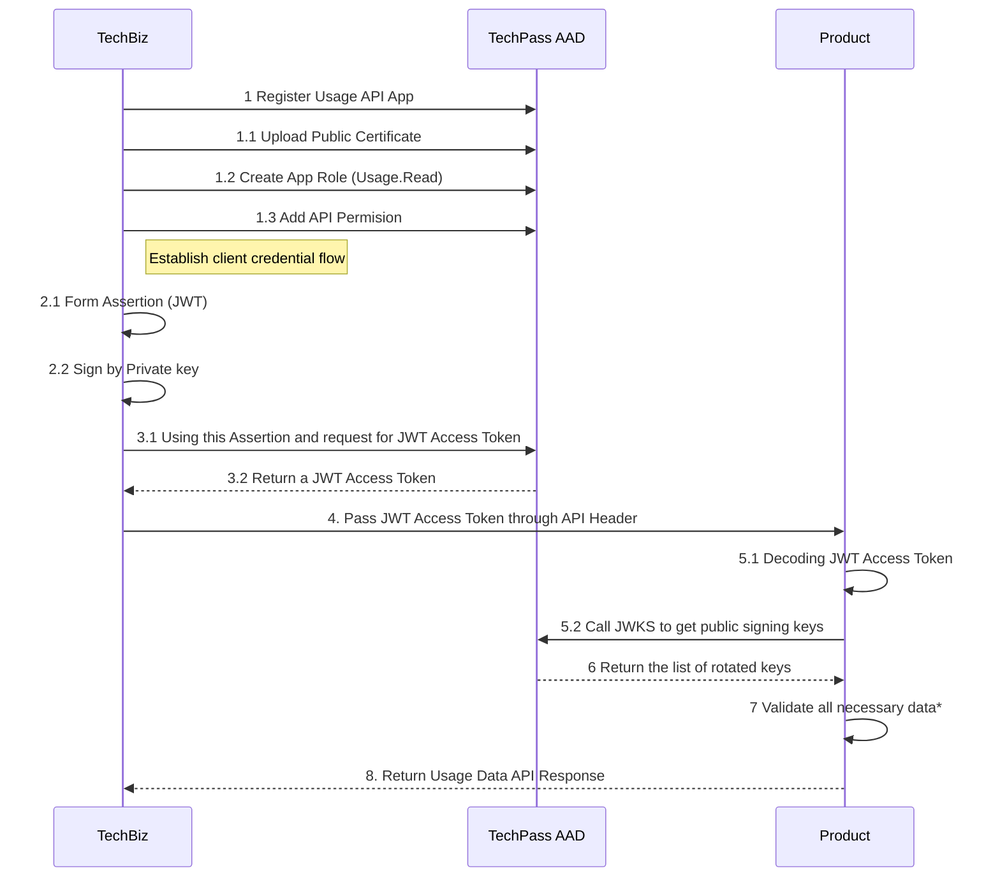
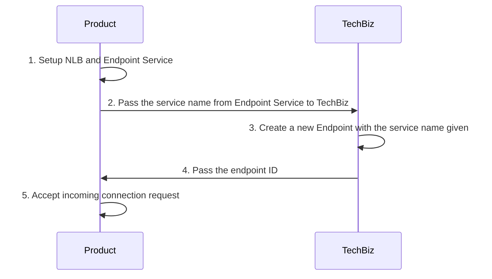

# RFC - Product Usage API

## Overview

TechBiz needs to get the actual Usage value in order to generate invoice for billing purposes. Hence, TechBiz needs to call each indivual `Products`' usage API endpoints to get the daily/monthly usage for a particular `Project` and a particular `Item`.
P.S. Check out [Domain Terms](domain_terms.md) for more information about domain information.

## Requirements

### Functional Requirements

- Accepts a valid `Item` identifier.
- Accepts a valid `Project` identifier.
- Accepts a date range.
- Returns usage data based on the above parameters.
  Link to [TechBiz Usage Demo API OpenAPI Documentation](https://stg.docs.developer.gov.sg/docs/private/341123320/TechBiz-usage-demp-api/)

### Security Requirements

- Usage API endpoint exposes only to TechBiz.
- Usage API endpoint has to be authenticated.
- Usage API endpoint exposes to TechBiz IP/network.

## Key Concepts

The key concept would be the authentication flow. We are using Azure Active Directory (AAD) for authentication. We are following Access Token way of authentication where TechBiz calls AAD and get access token before calling Usage API. The Usage API will then validate if the request is valid.

## Workflow



- [Step 2.1](https://docs.microsoft.com/en-us/azure/active-directory/develop/active-directory-certificate-credentials)
- [Step 3](https://docs.microsoft.com/en-us/azure/active-directory/develop/v2-oauth2-client-creds-grant-flow#second-case-access-token-request-with-a-certificate)

### \*: Validate all neccessary data:

1. Audience (App Id URI) matches
2. App ID matches
3. Issuer matches
4. Tenant matches
5. x5t & kid matches JWKS keys
6. Not expired and within valid time window (exp, nbf)

### Networking with AWS VPC



# Getting Started

There's a demo [repository](https://bitbucket.ship.gov.sg/projects/TECHSBUSIN/repos/TechBiz-demo-usage-api) that you can check. It includes the workflow from step 2 to 8. There's a sample app registered as well (Step 1). It can be used as a reference for both the API contract and the workflow implementations.

## App Registration

TechBiz will perform Step 1, to register, upload public certificate and setup the App, keep the private key in AWS secret manager (The Certification and Private key will be having a rotatation maximumly 13 months). Then TechBiz will pass these information to relavent `Product` for validations later:

1. Tenant ID
2. Audience
3. App ID
4. Issuer
5. JWKS url

## Networking whitelisting

TechBiz will be calling each `Product`'s Usage API from AWS Lambda. This requires Lambda to configure access to the private VPC

## Expose Usage API

Visit [HERE](https://stg.docs.developer.gov.sg/docs/private/341123320/TechBiz-usage-demp-api/) for Swagger API.
The usage data response will be in days even if the request is for a month. For example, requesting `from: 01-12-2020`, `to: 31-12-2020`, the response will be:

```js
{
    "data": [
        {
            "start": "01-12-2020",
            "end": "01-12-2020",
            "usage": 1,
        },
        {
            "start": "02-12-2020",
            "end": "02-12-2020",
            "usage": 1,
        },
        {
            "start": "03-12-2020",
            "end": "03-12-2020",
            "usage": 2,
        },
        // .... ommited days in-between
        {
            "start": "31-12-2020",
            "end": "31-12-2020",
            "usage": 8,
        }
    ],
    "total": 31
}
```

## Different type of usage in Usage API

There will be 3 types of usages which is configured at `item` level

1. SUM Usages
   This means the usage response represents the _absolute_ usage on the day. The billing calculation will aggregate the usages for the billing period. For instance:
   On day 1 the user consumed 1 SMS, the usage will be 1, and
   | Nth Day | Consumed |
   | ----------- | ----------- |
   | 1 | 3 unit |
   | 2 | 5 units |
   | 3 | 8 units|

   The Usage will be 3 + 5 + 8 = 16 units consumed and the invoice will be calculated based on this value

2. MAX Usages
   This means the usage response represents the state of the system (usage) on the day. For instance:
   | Nth Day | Consumed |
   | ----------- | ----------- |
   | 1 | 3 unit |
   | 2 | 8 units |
   | 3 | 5 units|

   The Usage value will be 8 units in this case

3. LAST_STATE Usages
   This means the usage response represents the state of the system (usage) on the day. For instance:
   | Nth Day | Consumed |
   | ----------- | ----------- |
   | 1 | 3 unit |
   | 2 | 8 units |
   | 3 | 5 units|

   The Usage value will be 5 units in this case as it is the latest state in the system on the last day.

## Usage API Validation

If the item is configured with a `monthly` pull, the request period must be start of the month and end of the month (`from: 01-12-2020`, `to: 31-12-2020`). If the item is configured with a `daily` pull, the request period must be on the same day (`from: 01-12-2020`, `to: 01-12-2020`).

## Usage API optional metadata

The API response can return an optional `metadata` field for billing calculation later. e.g.:

```js
{
  "data": [
      {
          "start": "01-12-2020",
          "end": "01-12-2020",
          "usage": 1,
          "metadata": { "unitPrice": 1.3 }
          // This unitPrice will override existing price configured
      },
  ],
  "total": 1
}
```

## How to validate Access Token

Access Token will be passed in the request header
`-H "Authorization: Bearer SLDKFJSDFI"...`
It is recommended to use a library to do the validation. For example Node.js project from the demo app, uses `jsonwebtoken` library to do the validation and `jwks-rsa` library to retrieve keys from AAD and validate if the token was signed with the rotated public keys from AAD JWKS.
