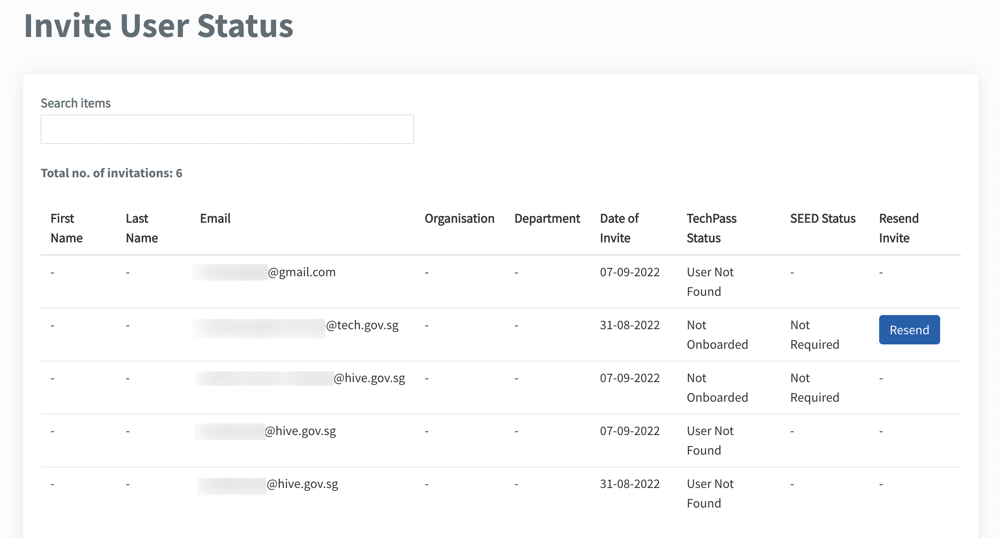

# Invite users

Public officers and vendors need to have a [TechPass](https://www.developer.tech.gov.sg/products/categories/digital-identity/techpass/overview.html) account to access [Singapore Government Tech Stack(SGTS)](https://www.developer.tech.gov.sg/singapore-government-tech-stack/overview/index.html) products. TechBiz allows public officers to send TechPass invites to other public officers or create a TechPass account on behalf of other public officers and vendors.

>**Notes:**
> - Public officers and vendors using a [non-SE GSIB](glossary) device can also use [TechPass Portal](http://portal.techpass.gov.sg/) to do a self-service sign-up for a TechPass account. For more information, refer to [TechPass documentation.](https://docs.developer.tech.gov.sg/docs/techpass-user-guide/) 
 Existing TechPass users can also request for [SEED provisioning](https://docs.developer.tech.gov.sg/docs/security-suite-for-engineering-endpoint-devices/).
> - SEED provisioning is needed to access SGTS products from the Internet device. If you are a public officer, click [Onboard to SEED](https://docs.developer.tech.gov.sg/docs/techpass-user-guide/#/onboard-to-seed) and follow the on-screen instructions. If you are a vendor, raise a [service request](https://go.gov.sg/techpass-sr) in the TechPass service desk.

## Prerequisites

- Public officers using a [non-SE GSIB](glossary) device can invite other public officers or vendors.

- Have the following information ready before proceeding:
  - Public officers and vendors who require a TechPass account
    - Organisation email address
    - **First name** and **Last name**
    - **Contact number**
    - **Organisation**
    - **Department** (optional)
    - **TechPass username** (for vendors)

## Invite users to TechPass

1.  [Log in to TechBiz portal.](log-in-to-TechBiz-portal.md)

2.  In **Overview**, click **Invite users**. Alternatively, from the left sidebar, click **Invite Users**.

3.  Select the invitation type.

There are 3 different invitation types:

| 
Invitation type
  | When to use |
| :------------------------------------------ |:-------------|
| Email invitation| Select this to create a TechPass account for the following users:  - Public officers using a non-SE GSIB device and whose organisational email address is in the format of \<your_name>@\<acronym for your agency>.gov.sg.  - Vendors or contractors using a non-SE GSIB device and whose organisational email address is in the format of \<your_name_from>.\<vendor organisation name>@\<acronym for the agency>.gov.sg.
| Create account | Select this to create a TechPass account for a vendor who does not have a non-SE GSIB device.
| Batch upload | Select this to create TechPass accounts for more than one public officer and vendor. |

4.  Select the required **invitation type**, enter the required details and click **Submit**.

For more information on each type of invitation, refer to the following:

* [Email invitation](#email-invitation)
* [Create account](#create-account)
* [Batch upload](#batch-upload)

### Email invitation

1. [Log in to TechBiz portal.](log-in-to-TechBiz-portal.md)

2. In **Overview**, click **Invite users**. Alternatively, from the left sidebar, click **Invite Users**.

3. Click **Email invitation**.

 <kbd></kbd>

4. Enter the required details and click **Submit**.

 <kbd></kbd>

Refer to the following for more information on the required details.

| 
Field Name
  | Description |
| :------------------------------------------ |:-------------|
| **Email address**| Enter the organisation email address of the public officer who requires a TechPass account. Email address must be in the format of \<your_name>@\<acronym for your agency>.gov.sg. for public officers and  \<your_name_from>.\<vendor organisation name>@\<acronym for the agency>.gov.sg. for vendors.  
| **Is onboarding to [SEED](https://docs.developer.tech.gov.sg/docs/security-suite-for-engineering-endpoint-devices/#/) required?** | Indicate **Yes** if the public officer needs SEED provisioning. Note: SEED provisioning is needed to access SGTS products from the Internet device.
| **Reason** | Enter the **Reason** why the public officer needs a TechPass account.

### Create account

1. [Log in to TechBiz portal.](log-in-to-TechBiz-portal.md)

2. In **Overview**, click **Invite users**. Alternatively, from the left sidebar, click **Invite Users**.

3. Click **Create account**.

 <kbd></kbd>

4. Enter the required details and click **Submit**.

 <kbd></kbd>

Refer to the following for more information on the required details.

| 
Field Name
  | Description |
| :------------------------------------------ |:-------------|
| **Email address**| Enter the organisation email address of the public officer or vendor who requires a TechPass account.
| **TechPass username** | This field is required if you are requesting TechPass account for a vendor. Enter the required username for the TechPass account.
| **First name,** **Last name,** **Contact number,** **Organisation, and Department**| Enter the required details. Note: **Department** is optional.
| **Is onboarding to [SEED](https://docs.developer.tech.gov.sg/docs/security-suite-for-engineering-endpoint-devices/#/) required?** | Indicate **Yes** if the public officer or vendor needs SEED provisioning. Note: SEED provisioning is needed to access SGTS products from the Internet device.
| **Reason** | Enter the **Reason** why the public officer or vendor needs a TechPass account.

### Batch upload

1. Click **Download excel template link**.

  <kbd></kbd>

2. Open the downloaded xlsx file, specify the required details and save the file.

4. In **Upload user list** section, select **Choose a file**.

5. Select the saved file and upload it.

> **Notes:**
>
> Usernames should contain the following:
> - Start and end with alphanumeric characters.
> - Username can contain alphanumeric characters, '_', ’ ‘, '-', or '.'. 
> - Two consecutive '.' is not allowed.

6. Click **Submit**.

 <kbd></kbd>

  - To view or edit user details, click the ellipsis on the row and click **View details**.

 <kbd></kbd>

  - To delete a single user, click **Remove**.

  <kbd></kbd>

  - To delete all users, click **Reset**. To confirm reset, click **Confirm**.
  <kbd></kbd>

>**Notes:**
>
>When an invitation is unsuccessful, you will receive an error notification during submission. You need to do the following:
>
>- To troubleshoot [email invitation](#email-invitation) or [create account](#create-account) issues:
>    - Raise a service request by clicking on the support email link provided in the error notification and attach the Trace ID.
>- To troubleshoot [batch upload](#batch-upload) issues:
>    1. In the user list of the uploaded file, click the ellipsis on the row with errors.
>    2. Click **View details**.
>    3. Amend the required details and click **Save**.
>    4. Click **Submit**.

## View status of invited users

Public officers can view the status of the users they have invited using TechBiz portal. The Invite User status displays the TechPass and SEED onboarding status of the invited users.

### To view the status of invited users:

1. [Log in to TechBiz portal.](log-in-to-TechBiz-portal.md)

2. In **Overview**, click **Invite users**. Alternatively, from the left sidebar, go to **Invite users**.

3. Go to **Invite user status**.

The page will indicate "No record found" when no users have been invited. If you have invited users using TechBiz, their TechPass and SEED onboarding status will be displayed.

<kbd></kbd>

>**Notes:**
> - Only users invited via TechBiz portal will be displayed on this list. 
> - First name and last name are displayed if the user signed up for TechPass via the TechPass portal or if the TechPass account was created through create account](#create-account)  or [batch upload](#batch-upload). 
> - Click Resend invite to re-invite users through email. Invitations can be sent once a day. 

