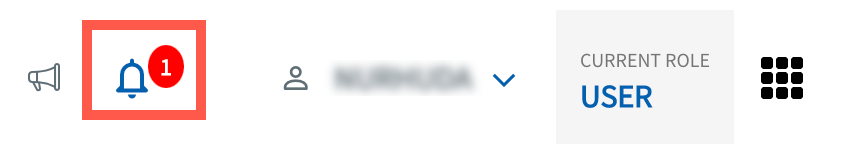
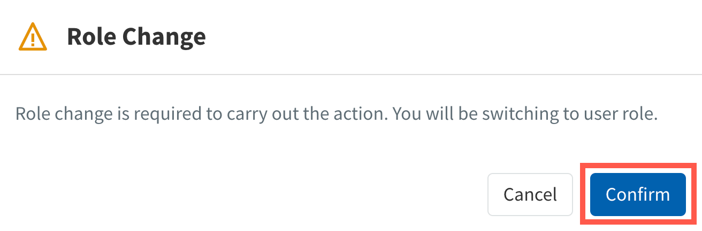

# Notifications

TechBiz notifies users of their request status and tasks awaiting their action. Users will receive notifications on the TechBiz portal and also by email. 

1. [Log in to TechBiz portal](log-in-to-TechBiz-portal) using your non-SE GSIB.

2. Click **Notifioation**.
<kbd>
 .
</kbd>

3. Click the required pending task.

<kbd>
 
</kbd>

>**Notes:**
> - A red dot beside notification indicates it is unread
> - Click **Mark all as read** to mark all the notifications as read.

4. If prompted to switch user role, click **Confirm** to switch.

<kbd>
 
</kbd>

5. Proceed to complete the task.

