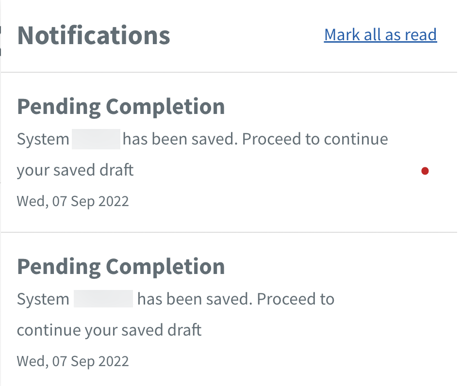

# Notifications

TechBiz notifies users of their request status and tasks awaiting their action. Users receive notifications on the TechBiz portal and also by email. 

1. [Log in to TechBiz portal](log-in-to-TechBiz-portal) using your non-SE GSIB.

2. Click  

3. Click the required pending task.
 

Red dot refers to unread notifications

4. If prompted to switch user role, you need to switch roles to complete task. 

5. Proceed to complete the task.

